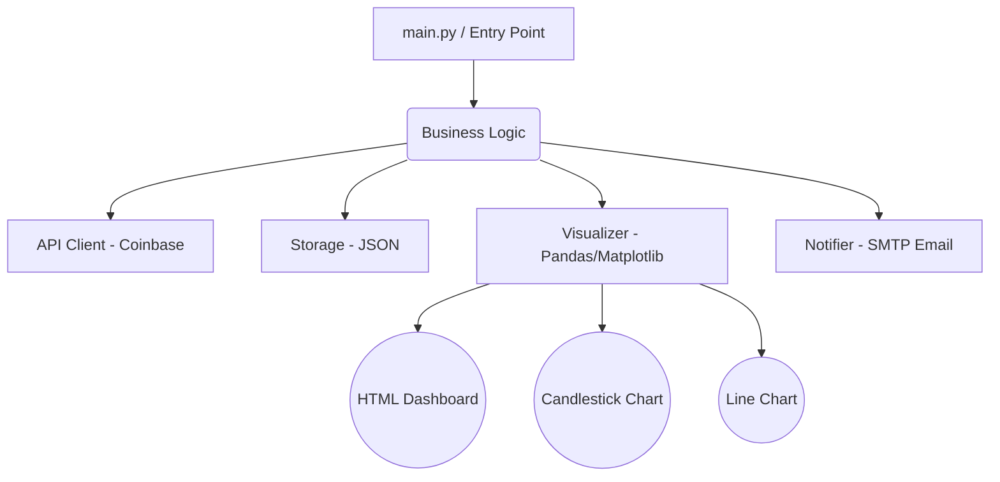

# 🚀 BPI Monitor & Automation Tracker


An enterprise-grade automation system that tracks the Bitcoin Price Index (BPI) via the Coinbase API, generates rich visualizations (Line & Candlestick charts), and produces a beautiful HTML dashboard alongside automated email alerts.

## 🏗️ Architecture



## ⚙️ Installation & Usage

1. **Clone the repository**
2. **Install dependencies:**
   ```bash
   pip install -r requirements.txt
   ```
3. **Set up Environment Variables:**
   Copy `.env.example` to `.env` and fill in necessary details (e.g. SMTP settings).
4. **Run the tracker:**
   ```bash
   python main.py
   ```